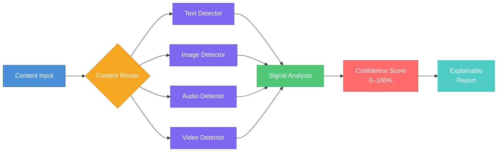
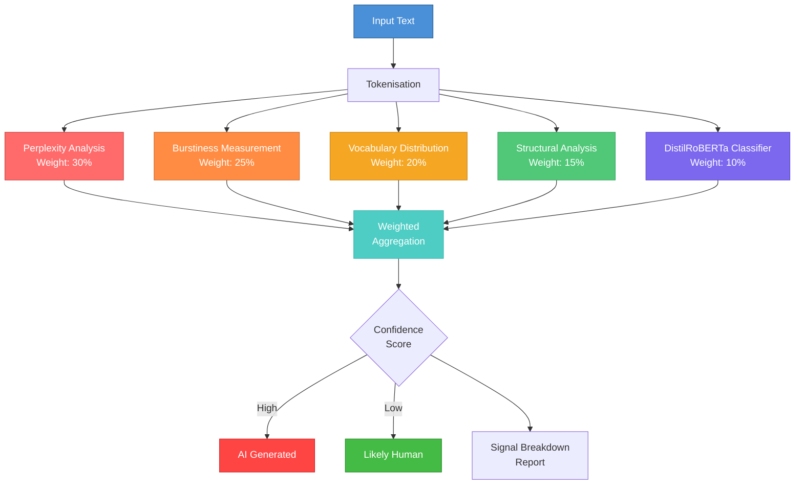
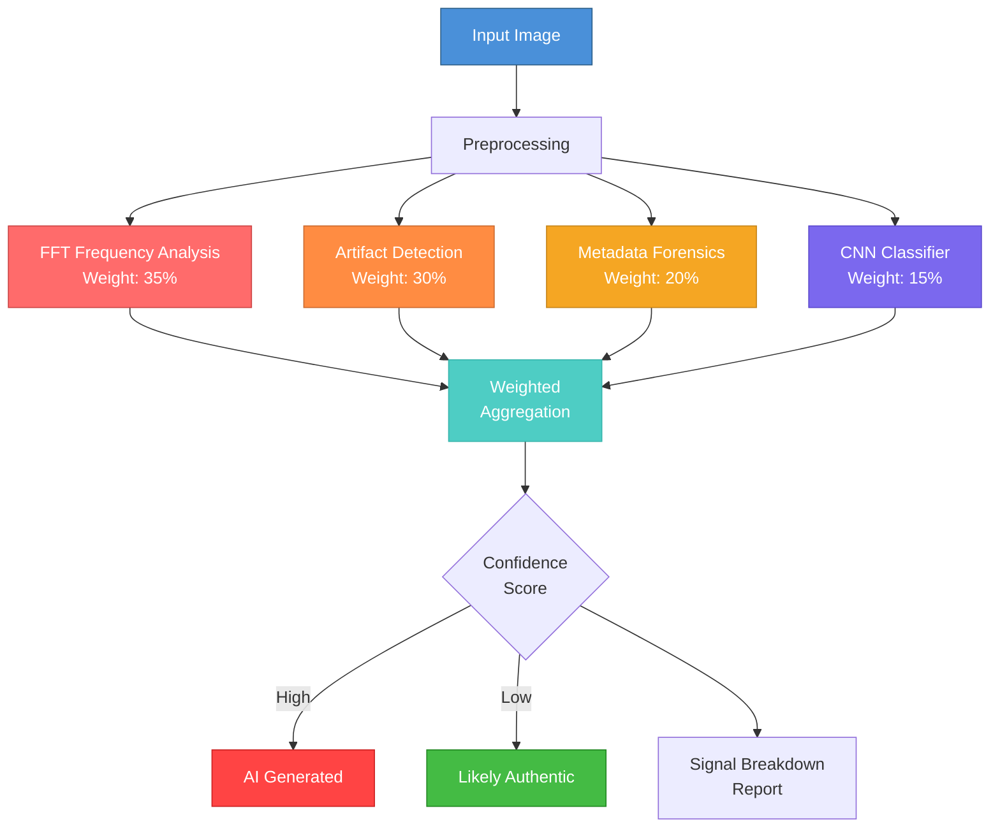
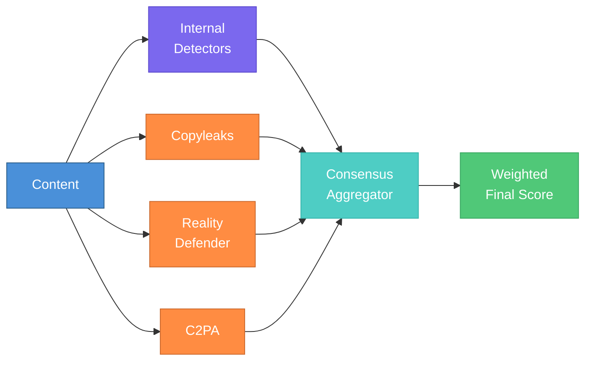
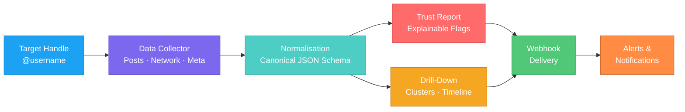
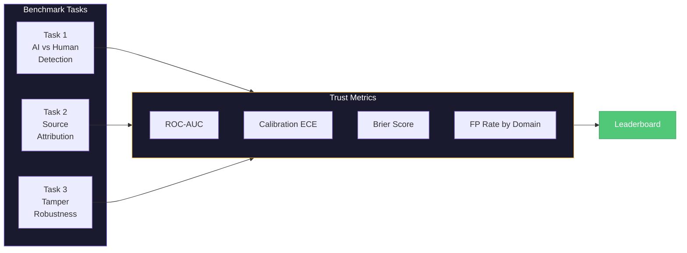
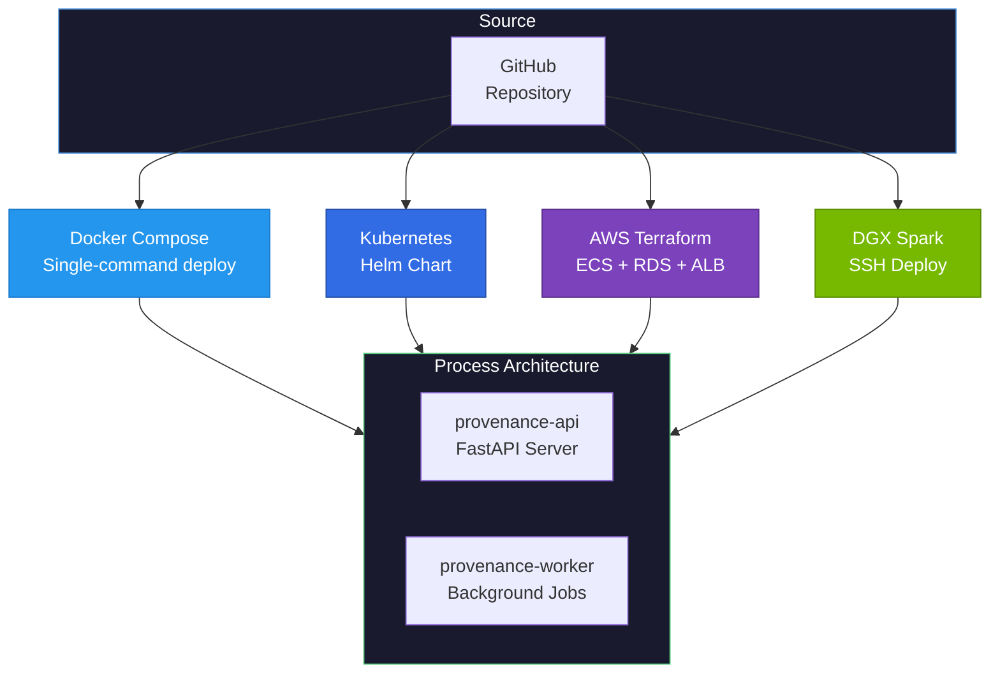
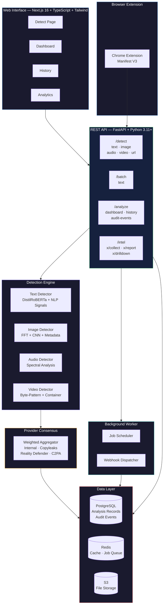

# AI Provenance Tracker

**An open-source, multi-modal AI content detection and provenance verification platform.**

Analyses text, images, audio, and video to determine whether content is AI-generated — providing confidence scores, explainable reasoning, and full audit trails. Built as a production-grade system with enterprise deployment options, a public benchmark suite, and a browser extension.

[](https://python.org)
[](https://fastapi.tiangolo.com)
[](https://nextjs.org)
[](https://pytorch.org)
[](LICENSE)
[](CONTRIBUTING.md)

---

## How It Works



Upload any content — the platform automatically routes it to the appropriate detection engine, runs multiple analytical signals, and returns a confidence score with a full breakdown of *why* the content was flagged.

---

## Why This Exists

Generative AI now produces text, images, audio, and video that is functionally indistinguishable from human-created content. Existing detection tools are fragmented — most handle a single modality, offer no transparency into their methodology, and cannot be self-hosted or audited.

AI Provenance Tracker solves this by providing a **unified, open-source platform** that:

- Detects AI-generated content across **four modalities** (text, image, audio, video)
- Returns **explainable confidence scores** — not just a binary yes/no, but a weighted breakdown of detection signals so users understand *why* a piece of content was flagged
- Supports **multi-provider consensus** — aggregates results from internal detectors and external providers (Copyleaks, Reality Defender, C2PA) with configurable weighting
- Ships with a **public benchmark and leaderboard** for reproducible evaluation of detection accuracy, source attribution, and tamper robustness
- Deploys anywhere — from a single `docker-compose up` to **Kubernetes (Helm)** or **AWS (Terraform IaC)**

The project targets journalists verifying sources, researchers ensuring academic integrity, content moderators identifying synthetic media, legal teams establishing provenance, and platform trust-and-safety teams automating detection at scale.

---

## Key Capabilities

### Multi-Modal Detection Engine

| Modality | Techniques | Models Detected |
|----------|-----------|-----------------|
| **Text** | Perplexity analysis, burstiness measurement, vocabulary distribution, structural analysis, fine-tuned DistilRoBERTa classifier | GPT-4, Claude, Llama, Gemini, and other LLMs |
| **Image** | FFT frequency domain analysis, artifact pattern recognition, metadata forensics, CNN binary classifier | DALL-E, Midjourney, Stable Diffusion |
| **Audio** | Spectral flatness analysis, dynamic range profiling, clipping detection, zero-crossing anomaly checks | AI-synthesised speech and audio |
| **Video** | Container signature analysis, byte-pattern detection, frame-level anomaly scoring | Deepfake and AI-generated video |

Every detection returns a **confidence score (0–100%)** with a signal-by-signal breakdown, so results are transparent and auditable.

### Explainable Scoring System

Rather than a black-box verdict, the platform breaks down each analysis into weighted signals:

#### Text Detection Pipeline



| Signal | Description | Weight |
|--------|-------------|--------|
| Perplexity | How predictable the text is to a language model — AI text shows lower perplexity | 30% |
| Burstiness | Variation in sentence complexity — AI text is more uniform | 25% |
| Vocabulary | Word choice diversity and repetition patterns | 20% |
| Structure | Paragraph and sentence uniformity | 15% |
| ML Classifier | Fine-tuned RoBERTa model prediction | 10% |

#### Image Detection Pipeline



| Signal | Description | Weight |
|--------|-------------|--------|
| Frequency Analysis | FFT spectral patterns characteristic of diffusion models | 35% |
| Artifact Detection | Generation-specific visual artefacts | 30% |
| Metadata Forensics | EXIF data anomalies and compression analysis | 20% |
| CNN Classifier | Trained binary classifier | 15% |

### Provider Consensus Engine



Aggregates detection results from multiple providers using configurable weighted scoring:

- **Internal detectors** — the platform's own ML models
- **Copyleaks** — external text detection
- **Reality Defender** — external media detection
- **C2PA** — content provenance standard verification

This consensus approach reduces false positives and increases confidence in results.

### X (Twitter) Intelligence Module

A full social media analysis pipeline for trust-and-safety investigations:



- **Data collection** — collects posts, network data, and metadata for a target handle (configurable time window)
- **Normalisation** — unifies posts, bot indicators, AI signals, and claim data into a canonical JSON schema
- **Trust reports** — generates explainable trust-and-safety reports with flagged content
- **Drill-down analytics** — cluster analysis, claims timeline, and automated alerts
- **Scheduling** — recurring collection runs with monthly request caps and kill-switches
- **Webhooks** — automated delivery of results with retry queues and dead-letter logging

### Public Benchmark and Leaderboard

A reproducible evaluation framework for AI detection systems:



- **Task 1: AI-vs-Human Detection** — multi-domain binary classification
- **Task 2: Source Attribution** — model-family identification accuracy
- **Task 3: Tamper Robustness** — detection resilience against paraphrasing, translation, and human editing
- **Trust metrics** — ROC-AUC, calibration ECE, Brier score, false-positive rates by domain
- **Static leaderboard** — published results at `benchmark/leaderboard/index.html`

### Batch Processing and Analytics

- **Batch endpoint** — process multiple text items in a single API call with per-item results
- **Analytics dashboard** — windowed totals, AI-rate trends, source/type breakdowns, daily timeline
- **Persistent history** — all detection results stored with full audit trails
- **Audit events** — structured event logging for compliance and review

### Browser Extension

A Chrome extension (Manifest V3) that analyses the visible text of any web page against the backend API, displaying verdict, confidence, model prediction, and explanation directly in the browser.

### Enterprise Deployment

Production-ready infrastructure across multiple deployment targets:



| Option | Configuration |
|--------|--------------|
| **Docker Compose** | Single-command local or production deployment |
| **Kubernetes** | Helm chart (`deploy/helm/provenance-stack`) with API/worker split |
| **AWS** | Terraform IaC stack — ECS + RDS + ALB + ECR (`deploy/terraform/aws`) |
| **DGX Spark** | SSH-based deploy script for NVIDIA infrastructure |

Includes process splitting (API server + background worker), Redis caching, structured logging, and configurable rate limiting with endpoint-aware quotas.

---

## Architecture



---

## Technology Stack

| Layer | Technology | Purpose |
|-------|-----------|---------|
| **Frontend** | Next.js 16, React 19, TypeScript, Tailwind CSS v4 | Server-rendered web interface |
| **Backend** | FastAPI, Python 3.11+, async throughout | High-performance API server |
| **ML/AI** | PyTorch 2.1+, Transformers 4.37+, DistilRoBERTa | Detection model inference |
| **Database** | PostgreSQL 15, SQLAlchemy 2.0 (async) | Persistent storage and audit |
| **Cache** | Redis 7 | Response caching and job queue |
| **Infrastructure** | Docker, Kubernetes (Helm), Terraform (AWS) | Multi-target deployment |
| **Quality** | Ruff, MyPy, Pytest, pre-commit hooks | Code quality and type safety |
| **Observability** | Structlog (structured logging) | Production monitoring |

---

## Quick Start

### Prerequisites

- Python 3.11+
- Node.js 18+ (for frontend)
- Docker (recommended)

### Docker Compose (Recommended)

```bash
git clone https://github.com/ogulcanaydogan/ai-provenance-tracker.git
cd ai-provenance-tracker

docker-compose up --build
# API:      http://localhost:8000
# Frontend: http://localhost:3000
# Docs:     http://localhost:8000/docs
```

### Manual Setup

```bash
# Backend
cd backend
python -m venv .venv
source .venv/bin/activate  # Windows: .venv\Scripts\activate
pip install -e ".[dev]"
uvicorn app.main:app --reload --port 8000

# Frontend (separate terminal)
cd frontend
npm install
npm run dev
```

---

## API Usage

### Text Detection

```bash
curl -X POST "http://localhost:8000/api/v1/detect/text" \
  -H "Content-Type: application/json" \
  -d '{"text": "Your text to analyse..."}'
```

```json
{
  "is_ai_generated": true,
  "confidence": 0.87,
  "model_prediction": "gpt-4",
  "analysis": {
    "perplexity": 12.4,
    "burstiness": 0.23,
    "vocabulary_richness": 0.67
  },
  "explanation": "High confidence AI detection based on low perplexity and uniform sentence structure."
}
```

### Image Detection

```bash
curl -X POST "http://localhost:8000/api/v1/detect/image" \
  -F "file=@image.png"
```

```json
{
  "is_ai_generated": true,
  "confidence": 0.92,
  "model_prediction": "stable-diffusion",
  "analysis": {
    "frequency_anomaly": 0.84,
    "artifact_score": 0.71,
    "metadata_flags": ["missing_exif", "unusual_compression"]
  },
  "explanation": "Image shows characteristic frequency patterns of diffusion models."
}
```

### Audio Detection

```bash
curl -X POST "http://localhost:8000/api/v1/detect/audio" \
  -F "file=@sample.wav"
```

### Video Detection

```bash
curl -X POST "http://localhost:8000/api/v1/detect/video" \
  -F "file=@clip.mp4"
```

### Batch Processing

```bash
curl -X POST "http://localhost:8000/api/v1/batch/text" \
  -H "Content-Type: application/json" \
  -d '{"items":[{"item_id":"a","text":"Sample one..."},{"item_id":"b","text":"Sample two..."}]}'
```

### X Intelligence Collection

```bash
curl -X POST "http://localhost:8000/api/v1/intel/x/collect" \
  -H "Content-Type: application/json" \
  -d '{"target_handle":"@example","window_days":30,"max_posts":300}'
```

### Dashboard Analytics

```bash
curl "http://localhost:8000/api/v1/analyze/dashboard?days=30"
```

Full interactive API documentation is available at `/docs` (Swagger UI) and `/redoc` (ReDoc) when the server is running.

---

## Project Structure

```
ai-provenance-tracker/
├── backend/
│   ├── app/
│   │   ├── api/v1/            # REST API endpoints (detect, batch, analyse, intel)
│   │   ├── core/              # Configuration, security, structured logging
│   │   ├── detection/         # Detection engines by modality
│   │   │   ├── text/          # NLP-based text detection (perplexity, RoBERTa)
│   │   │   ├── image/         # Frequency analysis + CNN image detection
│   │   │   ├── audio/         # Spectral analysis audio detection
│   │   │   └── video/         # Byte-pattern video detection
│   │   ├── models/            # Pydantic request/response schemas
│   │   ├── services/          # Business logic (consensus, scheduling, webhooks)
│   │   ├── db/                # SQLAlchemy models and async database layer
│   │   ├── middleware/        # Rate limiting, audit logging
│   │   ├── worker/            # Background job processing
│   │   └── main.py            # FastAPI application entrypoint
│   ├── tests/                 # Test suite (pytest)
│   ├── scripts/               # CLI tools (benchmarking, evidence packs, smoke tests)
│   └── pyproject.toml         # Python dependencies and tooling config
├── frontend/                  # Next.js 16 web application
├── extension/                 # Chrome extension (Manifest V3)
├── benchmark/                 # Public benchmark datasets, evaluation, leaderboard
├── deploy/
│   ├── helm/                  # Kubernetes Helm charts
│   └── terraform/             # AWS infrastructure-as-code (ECS + RDS + ALB)
├── docs/                      # Deployment and operational documentation
├── scripts/                   # Deployment and utility scripts
├── docker-compose.yml         # Local development compose
└── docker-compose.spark.yml   # Production-oriented compose
```

---

## Deployment

### Docker Compose (Local / Production)

```bash
docker-compose up --build                    # Development
docker-compose -f docker-compose.spark.yml up --build  # Production
```

### Kubernetes

```bash
helm install provenance deploy/helm/provenance-stack \
  --set api.image=your-registry/provenance-api:latest \
  --set worker.image=your-registry/provenance-worker:latest
```

### AWS (Terraform)

```bash
cd deploy/terraform/aws
terraform init
terraform plan
terraform apply
```

### DGX Spark (SSH)

```bash
./scripts/deploy_spark.sh
SPARK_DEPLOY_FRONTEND=true ./scripts/deploy_spark.sh  # Include frontend
```

---

## Running the Benchmark

```bash
python benchmark/eval/run_public_benchmark.py \
  --datasets-dir benchmark/datasets \
  --output-dir benchmark/results/latest \
  --leaderboard-output benchmark/leaderboard/leaderboard.json \
  --model-id baseline-heuristic-v0.1
```

Outputs benchmark results, per-domain accuracy breakdowns, and an updated leaderboard JSON.

---

## Development

```bash
# Install dev dependencies
cd backend
pip install -e ".[dev]"

# Run tests
pytest tests/ -v

# Lint and format
ruff check . && ruff format .

# Type checking
mypy app/

# Run background worker
python -m app.worker.main
```

See [CONTRIBUTING.md](CONTRIBUTING.md) for full contribution guidelines.

---

## Browser Extension

Load the unpacked extension from `extension/` in Chrome (`chrome://extensions` → Developer mode → Load unpacked). Analyses the current page's text against the backend API.

See [extension/README.md](extension/README.md) for details.

---

## Roadmap

- [x] Project structure and API foundation
- [x] Text detection engine with multi-signal analysis
- [x] Image detection engine with frequency and artifact analysis
- [x] Audio detection (spectral analysis)
- [x] Video detection (container and byte-pattern analysis)
- [x] Web interface with detection, dashboard, and history views
- [x] Public REST API with rate limiting and quotas
- [x] Chrome browser extension
- [x] Batch processing endpoint
- [x] API analytics dashboard with trend visualisation
- [x] Multi-provider consensus engine
- [x] X intelligence module (collection, reporting, drill-down, webhooks)
- [x] Public benchmark and leaderboard (detection, attribution, tamper robustness)
- [x] Enterprise deployment (Helm charts, Terraform IaC, worker process split)
- [x] Audit event logging and compliance tooling
- [x] Automated scheduling with budget guardrails
- [ ] Enhanced detection accuracy with larger training datasets
- [ ] Additional external provider integrations
- [ ] Firefox browser extension
- [ ] Real-time streaming detection API

---

## API Documentation

Once running, interactive API documentation is available at:

- **Swagger UI:** http://localhost:8000/docs
- **ReDoc:** http://localhost:8000/redoc

---

## Contributing

Contributions are welcome. See [CONTRIBUTING.md](CONTRIBUTING.md) for guidelines on code style, testing, and pull request format.

---

## License

MIT License — see [LICENSE](LICENSE) for details.

---

**Disclaimer:** No detection system achieves 100% accuracy. Results should be used as one signal in content verification, not as definitive proof of AI generation.
