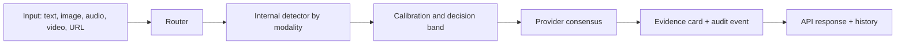
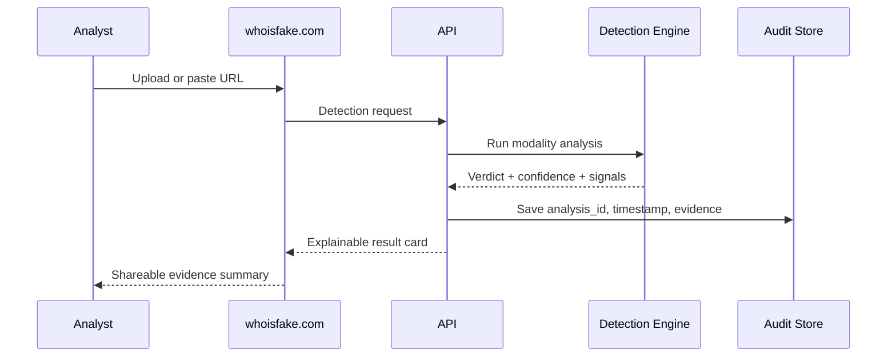

# AI Provenance Tracker

Detect AI-generated content with explainable evidence across text, image, audio, and video.
Built for fact-checking, newsroom workflows, trust-and-safety teams, and investigation support.

[](https://github.com/ogulcanaydogan/AI-Provenance-Tracker/actions/workflows/ci.yml)
[](https://github.com/ogulcanaydogan/AI-Provenance-Tracker/actions/workflows/codeql.yml)
[](https://python.org)
[](LICENSE)
[](https://www.bestpractices.dev/projects/12171)

[Live Demo](https://whoisfake.com) | [API Docs](https://api.whoisfake.com/docs) | [Benchmark & Status](docs/ROADMAP_STATUS.md)

## Start In 3 Steps

1. Upload a file or paste a public URL.
2. Run detection with modality-aware analysis.
3. Review an explainable evidence card (verdict, confidence, timestamp, analysis ID).

## Stable vs Experimental

| Modality | Status | Primary Entry |
|---|---|---|
| Text | Stable | `/api/v1/detect/text`, `/api/v1/detect/url` |
| Image | Stable | `/api/v1/detect/image`, `/api/v1/detect/url` |
| Audio | Experimental | `/api/v1/detect/audio` |
| Video | Experimental | `/api/v1/detect/video`, `/api/v1/detect/url` |

## What This Is / Isn't

**This is:** an evidence-first triage system for authenticity analysis.

**This is not:** legal proof or a sole-decision engine for high-stakes outcomes.

- Methodology limits: [docs/METHODOLOGY_LIMITATIONS.md](docs/METHODOLOGY_LIMITATIONS.md)
- Known operational status: [docs/ROADMAP_STATUS.md](docs/ROADMAP_STATUS.md)

## System Flow


```mermaid
flowchart LR
    A[Input: text, image, audio, video, URL] --> B[Router]
    B --> C[Internal detector by modality]
    C --> D[Calibration and decision band]
    D --> E[Provider consensus]
    E --> F[Evidence card + audit event]
    F --> G[API response + history]
```

## Fact-Checker Workflow


```mermaid
sequenceDiagram
    participant U as Analyst
    participant W as whoisfake.com
    participant API as API
    participant ENG as Detection Engine
    participant AUD as Audit Store

    U->>W: Upload or paste URL
    W->>API: Detection request
    API->>ENG: Run modality analysis
    ENG-->>API: Verdict + confidence + signals
    API->>AUD: Save analysis_id, timestamp, evidence
    API-->>W: Explainable result card
    W-->>U: Shareable evidence summary
```

## Evidence Card Example

```json
{
  "analysis_id": "a4f2d7e3-...",
  "content_type": "text",
  "result": {
    "decision_band": "uncertain",
    "is_ai_generated": false,
    "confidence": 0.57,
    "model_version": "text-detector:distilroberta-v1",
    "calibration_version": "calibrated-20260312:general"
  },
  "timestamp": "2026-03-19T12:31:00Z"
}
```

## Quick Start

### Docker Compose (recommended)

```bash
git clone https://github.com/ogulcanaydogan/AI-Provenance-Tracker.git
cd AI-Provenance-Tracker
cp backend/.env.example backend/.env
make up
```

- Frontend: `http://localhost:3000`
- API: `http://localhost:8000`
- Swagger: `http://localhost:8000/docs`

## API Snapshot

### URL detection

```bash
curl -X POST "https://api.whoisfake.com/api/v1/detect/url" \
  -H "Content-Type: application/json" \
  -d '{"url":"https://example.com"}'
```

### Text detection

```bash
curl -X POST "https://api.whoisfake.com/api/v1/detect/text" \
  -H "Content-Type: application/json" \
  -d '{"text":"Your content to analyze"}'
```

## Documentation Map

- API reference: [docs/API.md](docs/API.md)
- Deployment: [docs/DEPLOYMENT.md](docs/DEPLOYMENT.md)
- Roadmap and run evidence: [docs/ROADMAP_STATUS.md](docs/ROADMAP_STATUS.md)
- Architecture details: [docs/ARCHITECTURE.md](docs/ARCHITECTURE.md)

## Suggested GitHub About / Topics

**About text (recommended):**
Open-source multimodal AI provenance detection platform with explainable evidence cards, provider consensus, and benchmark-driven quality gates.

**Topics (recommended):**
`ai-detection`, `fact-checking`, `fastapi`, `nextjs`, `provenance`, `multimodal`

## Kisa TR Ozet

WhoisFake / AI Provenance Tracker; metin, gorsel, ses ve video iceriklerde AI-uretim sinyallerini aciklanabilir sekilde raporlar.

- Ne yapar: analiz + kanit karti + izlenebilirlik
- Nasil baslanir: URL yapistir veya dosya yukle, sonucu paylas
- Sinirlar: olasiliksal sonuc uretir; tek basina hukuki kanit degildir

## License

MIT - see [LICENSE](LICENSE).
